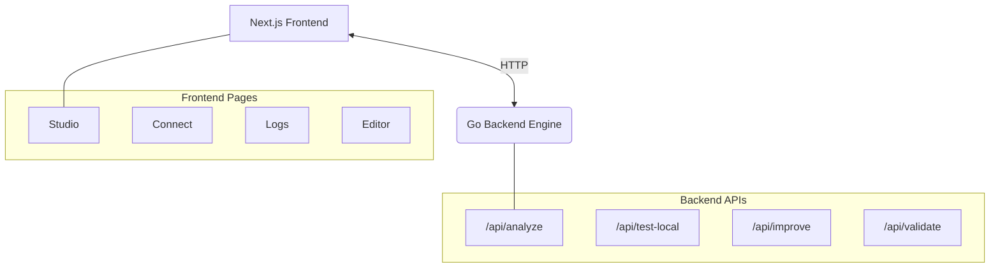

<div align="center">
  
  <h1 align="center">YamlAnchor</h1>
  <p align="center">
    <strong>Local-First CI/CD Self-Healing Pipeline Generator</strong>
    <br />
    Stop pushing blind. Start anchoring.
  </p>
</div>

<br />

YamlAnchor is a developer tool that **automatically generates, validates, and self-heals GitHub Actions CI/CD pipelines** from your codebase — before you ever push a commit. It runs entirely on your local machine, requires no cloud account, and produces a production-ready `.github/workflows/` YAML file through an autonomous correction loop.

## ⚠️ The Problem: CI/CD Pipeline Frustration

Every developer working with GitHub Actions, GitLab CI, or any YAML-based pipeline system faces the same friction:

1. **Write YAML blind** with no type-safety, guardrails, or local feedback.
2. **Push to remote** and wait 5–15 minutes for the CI run.
3. **Pipeline fails** due to a missing `actions/setup-node`, bad indentation, or a missing `needs:` dependency.
4. **Fix, commit, push, wait.**
5. **Repeat.**

This cycle is **slow**, **expensive** (burning CI compute minutes), and **error-prone**.

## 💡 The Solution: Local, Instant, Deterministic

YamlAnchor closes the feedback loop. It brings pipeline generation and validation **to your local machine**:

- 🔍 **Automatic stack detection** from your source code.
- ⚙️ **Pipeline generation** based on detected patterns (no generic templates).
- 🛡️ **Static analysis** checking for common failure modes.
- 🤖 **Self-healing correction loop** that automatically fixes issues until the pipeline passes.
- 🚀 **Deploy** directly to `.github/workflows/`.

All running locally in seconds.

---

## 🏗️ Architecture



The system consists of:
- **Go Backend (`/backend`)**: The core engine. Handles filesystem ops, YAML generation, static analysis, and self-healing. Uses native OS execution for Git and file dialogs.
- **Next.js Frontend (`/src`)**: The UI. A beautiful, 6-page dashboard driving the workflow.

---

## 🔄 The 4-Stage Workflow

### 1. Connect Repository
| Source | Method |
|---|---|
| **GitHub** | Paste URL or username. Backend clones to a temp dir via `git clone`. |
| **GitLab** | Supports `gitlab.com` and self-hosted via API. |
| **Local Folder** | Native OS file picker to scan any local directory. |

### 2. Understand Structure
The Go analyzer detects your stack automatically:
- `go.mod` → Go
- `package.json` → Node.js
- `requirements.txt` / `pyproject.toml` → Python
- `Dockerfile` → Docker

### 3. The Self-Healing Loop
Runs until zero issues remain. 

**Analyzer Checks:**
1. Missing `actions/setup-node` when using `npm`/`yarn`.
2. Missing `actions/setup-go` when using `go test`.
3. Missing `actions/setup-python` when using `pip`.
4. Missing `docker/setup-buildx-action` for Docker builds.
5. Missing `needs:` dependency in `deploy` jobs.
6. Missing `actions/checkout`.
7. Missing `on:` trigger.

**Deterministic Fixer:**
Applies the exact necessary correction for each detected issue automatically.

### 4. Deploy
Once clean:
- Deploy to `.github/workflows/`
- Save As (Native Dialog)
- Download `anchor.yml`
- Copy to clipboard

---

## 🛠️ Running Locally

### Prerequisites
- **Go 1.21+**
- **Node.js 18+** & npm
- **Git** (in PATH)

### 1. Start the Backend
```bash
cd backend
go run ./cmd/server.go
```
*Backend runs on `http://localhost:8080`*

### 2. Start the Frontend
```bash
npm install
npm run dev
```
*Frontend runs on `http://localhost:3000`*

---

## 📚 API Reference

| Endpoint | Description |
|---|---|
| `POST /api/analyze` | Scan project path, generate YAML |
| `POST /api/test-local` | Run static analysis on YAML |
| `POST /api/improve` | Apply deterministic fix |
| `POST /api/clone` | Git clone remote repo to temp dir |
| `POST /api/deploy` | Write YAML to `.github/workflows/` |
| `GET /api/logs` | Fetch real execution history |
| `GET /api/repositories`| Fetch visited repository history |

---

## 🗺️ Roadmap
- [ ] **Dagger integration** — true local containerized execution.
- [ ] **Persistent storage** — SQLite for logs/history.
- [ ] **GitLab CI output** — generate `.gitlab-ci.yml`.

---
*Built with Go + Next.js. No cloud. No magic. Just your code, analyzed locally.*